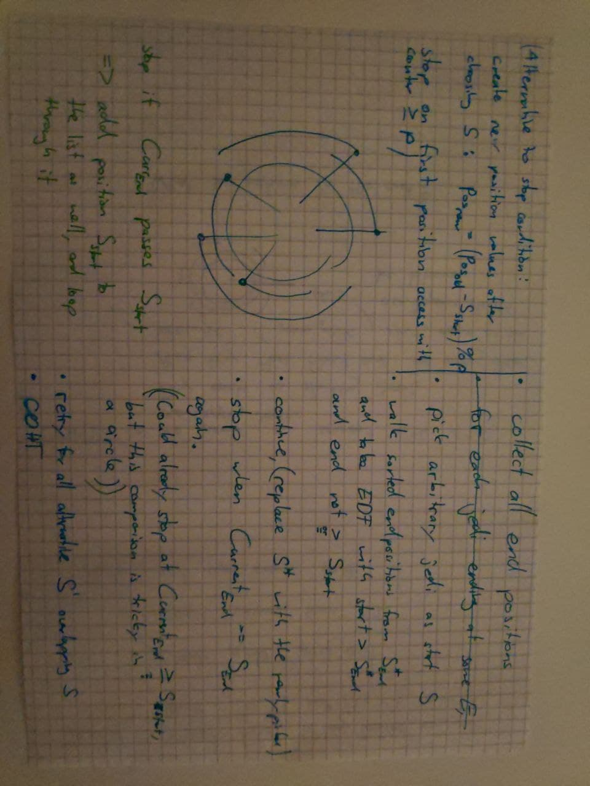
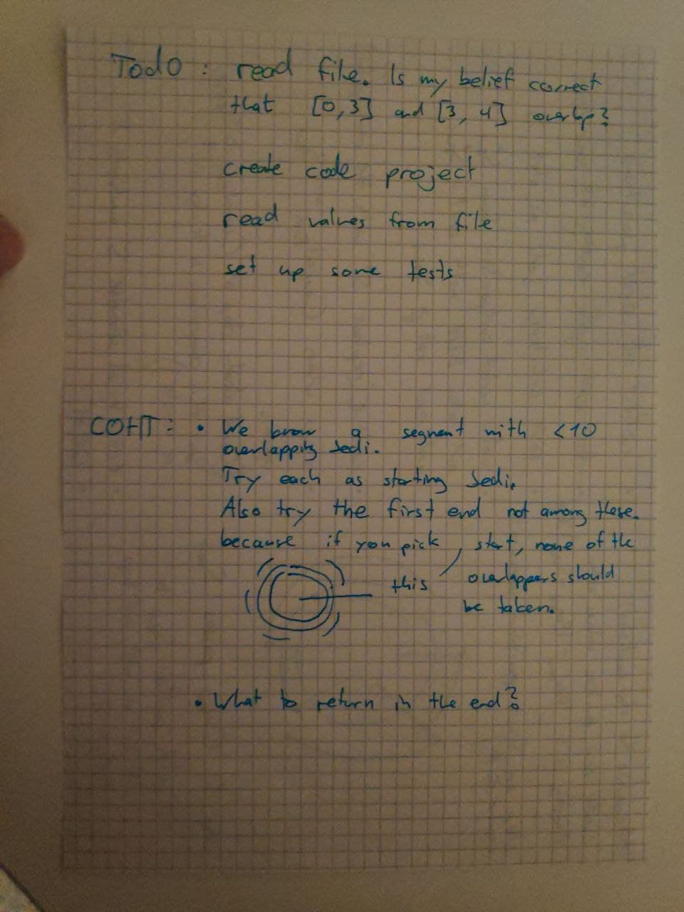
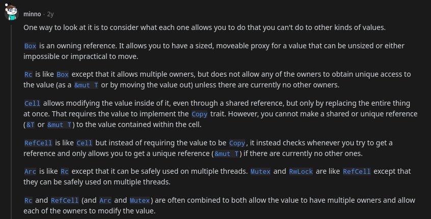

Learning rust by solving an Algolab task I failed to code in c++ thirteen times, with the master solution open. What could go wrong?


Below notes are mostly for me, but they miight be helpful for you too. If for some reason you want to see the idea of the Attack of the Clone task coded in rust instead of c++.

<hr/>

## Task

A circle, $n$ jedi (numbered from $1$ to $n$), $m$ segments (numbered from $1$ to $m$).

The jedi can't fight at the same time if their intervals overlap. They are too stupid to just protect a bit less than they could.

Goal: calculate the largest *number* of jedi that can fight without overlaps.

#### Inputs

$t \leq 35$ <kbd>\n</kbd> num testcases

$1 \leq n \leq 5\cdot10^4,\qquad 1\leq m \leq 10^9$ <kbd>\n</kbd>

for each of the $n$ jedi one line of form $(a,b)$, where $1\leq a, b \leq m$

#### Considerations

* numbers start at one, not zero
* $n$ and $m$ are never zero
* It's about the number of jedi, not the number of covered segments
* some jedi intervals might go around the "end" section $m$
* jedi $a,b$ overlaps with jedi $b,c$

#### Test Scaling

Only relevant for me if I figure out how to run rust on code expert that is intended for c++, but

1. small $n$, $m$, and there is a segment that no jedi protects
2. there is a segment that no jedi protects
3. there is a segment which at most 10 jedi protect

Having a segment that no jedi protects is useful because it provides a clear starting point where no cyclic overlaps can happen. We could in those cases just take the first ending jedi (or any one of them if there are multiple), then repeat.

## Notes


<center> </center>



### How to find the low-protected segment

This is where we want to start. How do we find it?

#### Option 1

We read all the intervals in, and keep one counter per each of the $m$ sections.

Con: uses much memory if $m$ is big. And takes $\mathcal{O}(n+m)$. That's not good, because $m$ could be a huge number even with very few jedi.

#### Option 2

Walk around the circle once, only considering start and end positions.
At the initial position, our count is an unknown value $v$. It represents the numbe of active jedi at this position. We walk through all such relevant positions, increasing $v$ if it is a start, decrasing if it is an end. For walking, we need a sorted list, done in $\mathcal{O}\left(n \log {\left(n\right)}\right)$.
[This link](https://stackoverflow.com/questions/56105305/how-to-sort-a-vec-of-structs-by-a-string-field) might explain sorting in rust.

We would like to know where the lowest number of jedi is at. For this, we don't need to know the initial $v$. We can simply keep track of its value and the best position so far. This is $\mathcal{O}(n)$.

### How to choose a starting jedi

of the $\ell \leq 10$ jedi in the low-protected segment, at most one can fight. If we pick one, the others are not fighting because they overlap in that segment.

If we pick none, we shall pick the first other jedi that has its END soonest. There could be multiple of those, but that does not matter. They all do not start before the low-protected segment, they all end at the same time, there is none that ends earlier, so they don't differ in the number of other jedi they occlude.

So we just do the whole program with different starting jedi $S$ at most $11$ times.
Save the value of $S^{start}$ for the iteration stop condition check (mentioned [later](#it's-a-Circle-though)).

In the end we just return the best (highest) of these 11 attempts.

### How to choose following jedi

Assume for a moment that the circle is not actually happening. Then we always pick according to Earliest-Deadline-First. Optimality proof by contradiction: If there was a different pick that were actually better, it would occlude less other jedi. Since we know a fixed position at which neither our pick $J_p$ nor the optimal pick $J_o$ had started, the only way this can happen is when $J_o$ ends earlier than $J_p$. Because moving the start of $J_o$ to the right only helps once it passes an ending - the first end it passes is the one of $J_p$, which would then not be overlapping with $J_o$ anymore and could safely be picked. But if $J_o$ indeed has a sooner end than $J_p$, it is equal to $J_p$.

So we conclude that we choose by EDF.

Of course we have to ignore jedi that overlap with already picked ones. For this I keep track of all jedi `Start`s that happened since the last `End` of a jedi I picked. That could be done with a constant-access array of size $n$ but I just use a hashset, since order does not matter to me and I want to clear the whole set easily every time I add a new `End` and hence invalidate all the jedi that started before that (and are thus already in the set but should no longer be).

#### It's a Circle though

when do we stop? 

We can't pick any jedi $J$ that has $J^{end} \geq S^{start}$ , since we already decided to take $S$ and can't allow overlaps with it. So whenever we pick the next jedi, we check whether the position $J^{end}$ is greater equals. If it is, stop the looping.

Since we are tracking the start positions anyway for [Option 2](#Option-2) of finding the low-protected segment, we can simply use the already-sorted list of all start and end positions. When we encounter $S^{start}$, we stop. However, this is actually **flawed** because we might then still consider a $J^{end}$ that just happens to come before $S^{start}$. So it's easier to just skipp all the $J^{start}$ in the list and always perform the check.

#### Would it make sense to have two lists?

one list with all starts and ends for choosing the low-protected segment, a different one with only all ends for choosing the jedi after that?

No. Because we need the memory for the $2n$ list anyway, and we only gain a constant factor in iteration speed that is offset by the same constant factor in sorting twice.

## Rust

### Parsing Input

Complete example to read a line from a file and parse it to an integer:
https://stackoverflow.com/a/29677167/2550406
https://doc.rust-lang.org/std/primitive.str.html#method.parse

Reading all lines from the file as an iterator:
https://doc.rust-lang.org/rust-by-example/std_misc/file/read_lines.html

Splitting the line into strings of numbers:
https://stackoverflow.com/a/26643821/2550406

### Primitives



### Error Handling

https://blog.burntsushi.net/rust-error-handling/

https://stackoverflow.com/questions/48430836/rust-proper-error-handling-auto-convert-from-one-error-type-to-another-with-que

### Testing

I wrote a macro and some functions, so that if I have files `test1.in` and `test1.out` I just have to write in my tests module:

```
#[cfg(test)]
mod tests{
	use super::*;
	
	tmf!(test1); // test my file "test1.in"
	tmf!(my_custom_test); // test my file "my_custom_test.in"

}
```

## Running On Code Expert

==TODO==

I guess it could work by compiling to assembly and using it inline in c++...?

## Other

If I ever want to find this link again that discusses interoperating between c++ and rust by going through C, I will find it here.

* https://hsivonen.fi/modern-cpp-in-rust/
* https://docs.rust-embedded.org/book/interoperability/rust-with-c.html
* https://github.com/eqrion/cbindgen
